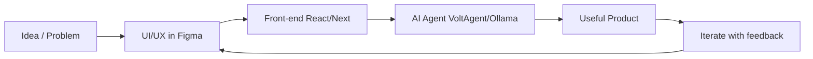
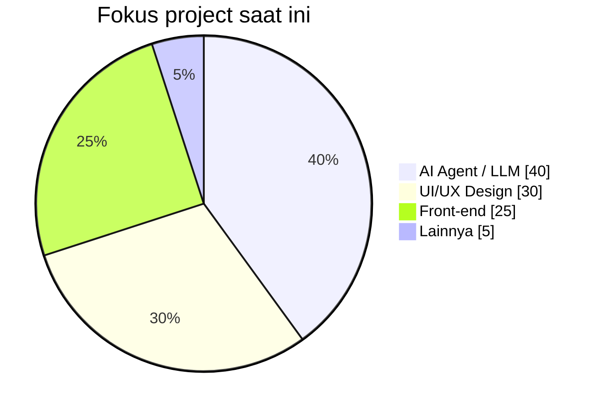

# Hi there, I'm Fadhli 👋

[](https://github.com/mohfadhli27)

<p align="center">
  <b>Mahasiswa Teknologi Rekayasa Multimedia @ PENS</b><br/>
  Saya merancang UI yang jelas, membangun front-end yang rapi,<br/>
  dan mengintegrasikan <b>AI agent</b> ke produk web nyata.
</p>

<p align="center">
  <a href="https://portofolio-fadhli.netlify.app"></a>
  <a href="https://www.linkedin.com/in/mohammadfadhli27"></a>
  <a href="mailto:mohfadli095@gmail.com"></a>
  <a href="https://www.instagram.com/mohfadhli_/?hl=id"></a>
</p>

---

## About me

```text
┌─────────────────────────────────────────────────────────┐
│  Name     : Fadhli (RUZZ)                               │
│  Role     : AI Agent · UI/UX · Front-end                │
│  School   : PENS — Teknologi Rekayasa Multimedia        │
│  Status   : Junior, open to opportunities               │
│  Focus    : VoltAgent · Ollama · React/Next.js · Figma  │
└─────────────────────────────────────────────────────────┘
```

- Sedang membangun AI agent yang bisa dipasang ke aplikasi web
- Desain di Figma, lalu eksekusi ke React / Next.js
- Eksplorasi RAG, workflow agent, dan product UX
- Open untuk magang, kolaborasi, dan diskusi project

---

## How I work



---

## Skill level

> Estimasi kemampuan berdasarkan project — terus berkembang.

| Area | Level | Progress |
|------|:-----:|----------|
| TypeScript / React / Next.js | Advanced |  |
| UI/UX · Figma | Advanced |  |
| AI Agent · VoltAgent | Intermediate+ |  |
| Ollama / Local LLM | Intermediate |  |
| Node.js · API | Intermediate |  |
| Flutter | Intermediate |  |
| Docker · PostgreSQL | Growing |  |

### Stack icons

<p align="center">
  
</p>

<p align="center">
  
  
  
  
  
</p>

---

## GitHub analytics

<p align="center">
  
  
</p>

<p align="center">
  
</p>

<p align="center">
  
</p>

### Activity graph

<p align="center">
  
</p>

---

## Contribution snake

<p align="center">
  <picture>
    <source media="(prefers-color-scheme: dark)" srcset="https://raw.githubusercontent.com/mohfadhli27/mohfadhli27/output/github-contribution-grid-snake-dark.svg" />
    <source media="(prefers-color-scheme: light)" srcset="https://raw.githubusercontent.com/mohfadhli27/mohfadhli27/output/github-contribution-grid-snake.svg" />
    
  </picture>
</p>

---

## Selected projects

| Project | What it is | Stack | Link |
|:--|:--|:--|:--|
| **DARSI** | AI agent untuk konsultasi web | Agent · Web | [Open](https://github.com/mohfadhli27/darsi-cs) |
| **Sapadarsi** | AI consultation flow | Next.js · AI | [Open](https://github.com/mohfadhli27/sapadarsi) |
| **Sapabidan** | Multi-role AI assistant | Next.js · AI | [Open](https://github.com/mohfadhli27/sapabidan) |
| **Face Recognition** | Computer vision experiment | CV · JS/TS | [Open](https://github.com/mohfadhli27/face-recognition) |



---

## Profile cards

<p align="center">
  
</p>

<p align="center">
  
  
</p>

---

## Let's connect

- Portfolio → [portofolio-fadhli.netlify.app](https://portofolio-fadhli.netlify.app)
- Email → `mohfadli095@gmail.com`
- LinkedIn → [mohammadfadhli27](https://www.linkedin.com/in/mohammadfadhli27)

<p align="center">
  
</p>

---

<p align="center">
  
</p>

<p align="center">
  <i>Junior, open to opportunities — curious, consistent, and shipping.</i>
</p>
